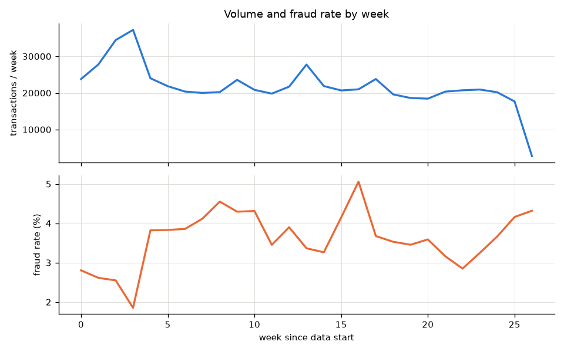
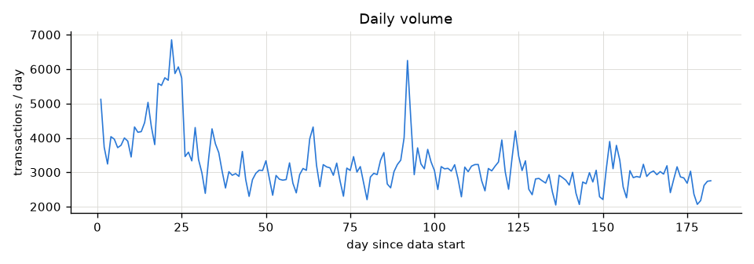
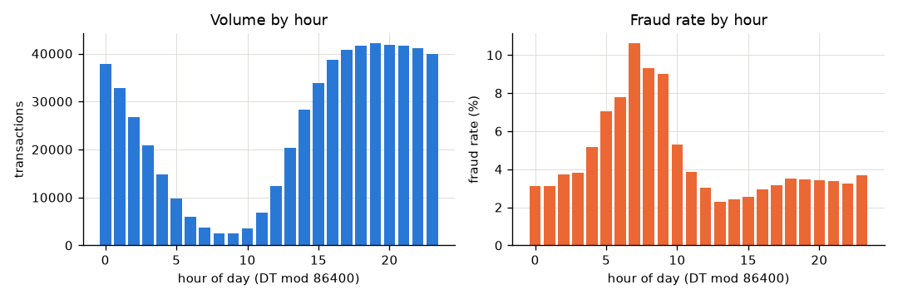
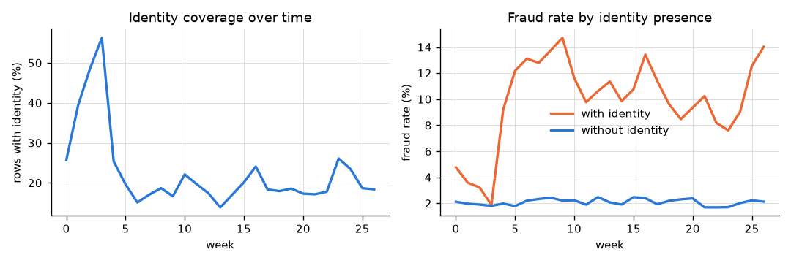
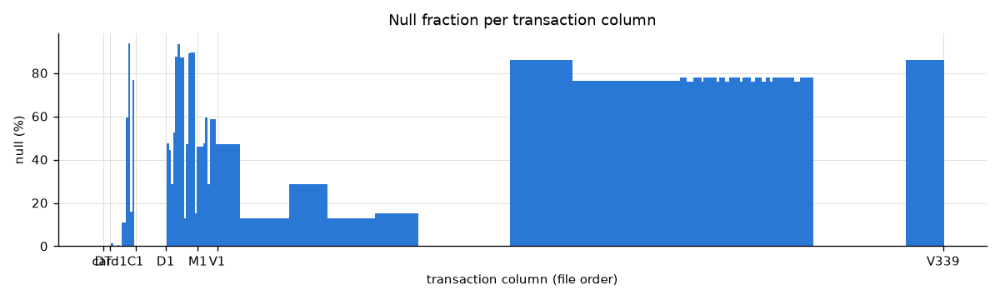
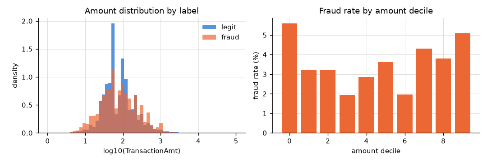
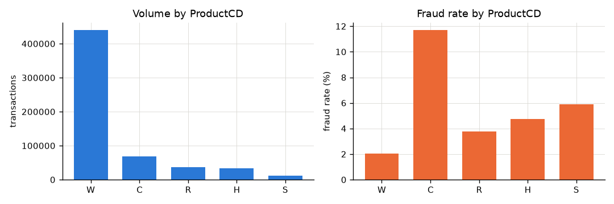
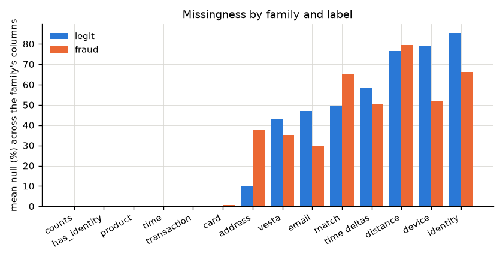
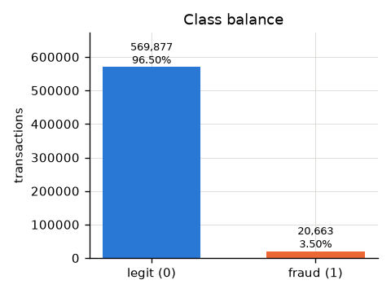

# Exploratory data analysis

Evidence produced by `uv run python scripts/eda.py` →
`reports/eda/dataset_summary.json`, `missingness.csv`,
`categorical_cardinality.csv` and `reports/eda/*.png`. All numbers below are from the labelled training data
(`train_transaction` left-joined with `train_identity`, 590,540 rows × 435
columns). Nothing here is fit or reused by the model pipeline.

## 0. Feature families

The competition host describes the columns by family; precise meanings are
masked on purpose, so the analysis works at family level and infers only
what the data supports.

| family | columns | host's description | what this EDA adds |
|---|---|---|---|
| transaction | `TransactionAmt` | payment amount | U-shaped fraud rate by amount (§7) |
| time | `TransactionDT` | seconds from an undisclosed origin | 182 days, daily and weekly cycles; raw value is "position in the data" (§2) |
| product | `ProductCD` | product / service code | 5 levels; `C` 11.7 % fraud vs `W` 2.0 %; decides whether identity exists (§3) |
| card | `card1`–`card6` | card attributes (issuer, type, …) | `card1` is a 13.5k-level identifier; `credit` 6.7 % vs `debit` 2.4 % |
| address | `addr1`, `addr2` | billing region / country | **null for 37.5 % of fraud vs 10.2 % of legit** (§4b) |
| distance | `dist1`, `dist2` | distances between transaction attributes | 60 – 94 % null |
| email | `P_`/`R_emaildomain` | purchaser / recipient domain | recipient present ⇒ 5 – 16 % fraud; mostly product-driven |
| counts | `C1`–`C14` | counts of entities linked to the card | never null; ablation later shows them irreplaceable |
| time deltas | `D1`–`D15` | days since earlier events | `D1` reconstructs a card start-day (§6) |
| match | `M1`–`M9` | match flags (name/address/…) | null for 65 % of fraud vs 49 % of legit |
| vesta | `V1`–`V339` | provider-engineered ranks / counts / relations | 15 identical-null-pattern blocks (§4) |
| identity | `id_01`–`id_38` | network / digital identity | exists for 24 % of rows, almost only non-`W` products |
| device | `DeviceType`, `DeviceInfo` | device class / model | `mobile` 10.2 % fraud; `DeviceInfo` 1,786 levels |

## 1. Label

- 20,663 of 590,540 transactions are `isFraud = 1`: **3.50 %** (569,877
  legitimate; fig. 00).
- The rate is not stationary. Weekly it runs 1.9 – 5.1 %, lowest in week 3 and
  highest in week 16 (fig. 01). The first four weeks are systematically below the
  rest (see §5).
- **Fraud is clustered by entity.** Using the D1-derived entity proxy from §6,
  81 % of fraud rows (16,659 / 20,617) sit in entities that have two or more
  fraud rows, and 3,118 entities are *entirely* fraud. This is consistent with
  the competition host's statement that once an account is reported, its
  subsequent transactions are labelled fraud too. The label therefore means
  "this transaction belongs to an account that was (or became) reported as
  fraudulent", not "this transaction is the fraudulent act". See ADR 0001.

## 2. Time

- `TransactionDT` runs from 86,400 s to 15,811,131 s: exactly **182 days**, every
  day populated, 2,048 – 6,852 transactions per day (fig. 02), rows already
  sorted by time.
- `DT mod 86 400` behaves like a local clock: volume has a deep trough at
  "hours" 8 – 9 and a broad evening peak (fig. 03). The fraud rate is inverted:
  **10.6 % at hour 7, 9 % at hours 8 – 9, ~2.5 % at hours 13 – 15.** Hour of day is
  a genuine signal, and it is computable at prediction time.
- `DT // 86 400 mod 7` shows a 7-day cycle in volume (70k – 99k per weekday
  slot) but a flat fraud rate (3.2 – 3.7 %). Weekday is weak on its own.
- Raw `TransactionDT` encodes *which part of the dataset* a row is in. It must
  not be a model feature; only derived cyclical features may be argued in.

## 3. Identity

- 24.4 % of transactions have an identity row. Presence is almost entirely a
  function of product: **`W` has identity for 0.0 % of rows; `C` 90.8 %; `H`, `R`,
  `S` ≥ 99.6 %.** `has_identity` is therefore close to a proxy for
  `ProductCD != "W"`, and any lift it shows should be attributed to product
  first.
- Fraud rate with identity 7.8 %, without 2.1 % — again largely the product mix
  (`W` is 2.0 % fraud; `C` is 11.7 %).
- **Identity coverage moves with time** (fig. 04, left): 26 % in week 0, 56 % in
  week 3, then 14 – 26 % for the rest of the period. The weeks with high
  coverage are the weeks with the *lowest* fraud rate among identity-bearing
  rows (fig. 04, right). Identity availability correlates with both label and
  time, as the project notes warned; it is not a safe standalone signal without
  a temporal split.
- Within identity rows, nine columns (`id_07`, `id_08`, `id_21` – `id_27`) are
  ≥ 96 % null even when identity is present; `id_01`, `id_12` are never null,
  and `id_02`, `id_11`, `id_28`, `id_29`, `id_35` – `id_38`, `DeviceType` are
  ≤ 2 % null.

## 4. Missingness

- 25 columns are fully populated (`TransactionID`, `isFraud`, `TransactionDT`,
  `TransactionAmt`, `ProductCD`, `card1`, all 14 `C*`, `D1`, and the
  `V279 – V321` block); 12 columns are > 90 % null.
- By family (median null fraction): `card*` 0.3 %, `addr*` 11 %, `emaildomain`
  16 % (purchaser) / 77 % (recipient), `C*` 0 %, `D*` 52 % (range 0 – 93 %),
  `M*` 48 %, `V*` 47 % (range 0 – 86 %), `dist*` 60 – 94 %, `id_*` 76 – 99 %.
- **The 339 `V` columns fall into 15 blocks with identical null patterns** (same
  rows missing): `V1–V11`, `V12–V34`, `V35–V52`, `V53–V74`, `V75–V94`,
  `V95–V137`, `V138–V166` (two interleaved blocks), `V167–V216` (two),
  `V217–V278` (two), `V279–V321` (two), `V322–V339`. Blocks are missing 0 %
  (`V95–V137`, `V279–V321`) up to 86 % (`V138–V166`, `V322–V339`). The blocks
  are almost certainly engineered feature groups computed under different
  conditions; missingness is structured, not random, and should be treated as
  informative (fig. 05).
- `card4` / `card6` null on 0.27 % of rows. `card6` has two rare junk levels
  (`debit or credit`: 30 rows, `charge card`: 15 rows).

### 4b. Missingness by label (`missingness.csv`, fig. 08)

Mean null fraction across each family's columns, legitimate vs fraud:

| family | legit | fraud | | family | legit | fraud |
|---|---:|---:|---|---|---:|---:|
| address | 0.10 | **0.38** | | email | 0.47 | 0.30 |
| match | 0.49 | **0.65** | | vesta | 0.43 | 0.35 |
| time deltas | 0.58 | 0.50 | | device | 0.79 | 0.52 |
| distance | 0.77 | 0.80 | | identity | 0.86 | 0.66 |

Two different mechanisms are visible. Identity, device, recipient email and
`V` are *less* often missing for fraud because fraud concentrates in the
non-`W` products that carry those records — the product effect again.
**Address and match flags are *more* often missing for fraud** (address
3.7×), which is not explained by product and is the kind of signal a model
should be allowed to see; the pipeline therefore keeps missingness as
information (indicator columns, `<missing>` one-hot level, NaN routed by the
trees) rather than imputing it away.

### 4c. Cardinality (`categorical_cardinality.csv`)

Distinct values per column (433 columns): 119 have ≤ 10, 160 ≤ 100, 64
≤ 1,000, 88 ≤ 100,000, and 2 exceed 100,000 (`TransactionDT` itself, and
`id_02` with 115k distinct values — a near-continuous quantity, not a code). Among the 31 string columns, 25 have ≤ 5 levels
(one-hot is fine), and six are high-cardinality: `DeviceInfo` 1,786, `id_33`
260, `id_31` 130, `id_30` 75, `R_emaildomain` 60, `P_emaildomain` 59 —
these need an encoding decision (ADR 0005), as do the numeric-but-nominal
`card1` (13,553), `card2` (500), `addr1` (332).

## 5. Distribution shift in the first month

Weeks 0 – 3 differ from the remaining 23 weeks on three axes at once:

| week | volume | `W` share | `H`+`R` share | identity coverage | fraud rate |
|-----:|-------:|----------:|--------------:|------------------:|-----------:|
| 0 | 23,810 | 72.6 % | 15.4 % | 25.7 % | 2.81 % |
| 1 | 27,803 | 59.2 % | 27.4 % | 39.4 % | 2.61 % |
| 2 | 34,470 | 49.8 % | 35.4 % | 48.5 % | 2.55 % |
| 3 | 37,251 | 41.7 % | 43.0 % | 56.3 % | 1.85 % |
| 4 | 24,041 | 73.1 % | 10.9 % | 25.4 % | 3.82 % |
| 5 – 26 | 18 – 28k | 79 – 84 % | 5 – 7 % | 14 – 26 % | 2.9 – 5.1 % |

Products `H` and `R` surge to 43 % of volume, and *their* fraud rate is 0.4 –
2 % in these weeks versus 8 – 18 % afterwards. The most likely reading is a
seasonal (holiday) burst of legitimate gift-type purchases. Consequences:

- A model trained on weeks 0 – 3 learns "H/R with identity ⇒ safe", which is
  wrong for the rest of the year.
- Validation and test windows must sit after week 4, and the training window's
  start is a decision, not a default (ADR 0002).
- Temporal splitting is not optional: a random split would hide this shift
  entirely.

## 6. `D*` columns and entity reconstruction

- `D1` is never null, integer-valued, range 0 – 640 days — beyond the 182-day
  span, so it counts from before the dataset starts. It behaves like "days
  since this card was first seen".
- `day − D1` is constant for a card's lifetime. Grouping on
  `(card1, day − D1)` yields **149,527 candidate entities** from 13,553 `card1`
  values (median 2 distinct start-days per `card1`). This is the well-known
  IEEE-CIS "card UID" reconstruction.
- `D2`, `D3`, `D5`, `D7`, `D10`, `D13` are ≥ 0; `D4`, `D6`, `D11`, `D12`, `D14`,
  `D15` include negatives (down to −193). `D9 ∈ [0, 0.958]` is hour-of-day / 24
  (null 87 %). `D8` is fractional days.
- These columns are the project's biggest leakage/legitimacy question. Whether
  an entity id or any per-entity aggregate enters the model, and how it is
  computed so that only strictly earlier rows contribute, is decided in writing
  before it is coded (`docs/leakage_audit.md`, ADR 0004).

## 7. Amount

- `TransactionAmt` ranges 0.25 – 31,937; median 68.8, p99 1,104. Fraud median
  75.0 vs legitimate 68.5 — location barely differs.
- Fraud rate by decile is **U-shaped**: 5.6 % in the lowest decile (< 26),
  1.9 – 3.6 % through the middle, 5.1 % in the top decile (> 275) (fig. 06).
- 48 % of amounts have non-zero cents; fraud 47 %, legitimate 48 % — the cents
  pattern is not discriminative by itself.

## 8. Categoricals

Fraud rate by level, most frequent levels (fig. 07 for `ProductCD`):

| column | levels (n, fraud %) |
|---|---|
| `ProductCD` | W 439,670 (2.0) · C 68,519 (11.7) · R 37,699 (3.8) · H 33,024 (4.8) · S 11,628 (5.9) |
| `card4` | visa 384,767 (3.5) · mastercard 189,217 (3.4) · amex 8,328 (2.9) · discover 6,651 (7.7) |
| `card6` | debit 439,938 (2.4) · credit 148,986 (6.7) |
| `P_emaildomain` | gmail 228,355 (4.4) · yahoo 100,934 (2.3) · null 94,456 (3.0) · hotmail 45,250 (5.3) · outlook 5,096 (9.5) · att.net 4,033 (0.7) |
| `R_emaildomain` | null 453,249 (2.1) · gmail 57,147 (11.9) · hotmail 27,509 (7.8) · outlook 2,507 (16.5) · icloud 1,398 (12.9) |
| `DeviceType` | null 449,730 (2.1) · desktop 85,165 (6.5) · mobile 55,645 (10.2) |
| `M4` | null 281,444 (1.9) · M0 196,405 (3.7) · M2 59,865 (11.4) · M1 52,826 (2.7) |

Cardinalities: `card1` 13,553 · `card2` 500 · `card3` 114 · `card5` 119 ·
`addr1` 332 · `addr2` 74 · `P_emaildomain` 59 · `R_emaildomain` 60 ·
`DeviceInfo` 1,786 · `id_31` (browser) 130 · `id_33` (screen) 260.

`card1` is high-cardinality and behaves like an identifier; any encoding of it
is fit on training rows only (§4.5 of the project rules). `R_emaildomain`
present vs absent is a strong signal (2.1 % vs 5 – 16 %) that is also mostly a
product effect (recipient email exists for non-`W` products).

## 9. What this means for the next stages

1. **Split by time, after the seasonal month.** Validation and test windows
   must be entirely inside weeks 5 – 26. Whether weeks 0 – 3 stay in training
   is a deliberate choice (ADR 0002).
2. **`ProductCD` explains much of what looks like identity, email and device
   signal.** Baselines should include it so later features are credited only
   for what they add.
3. **Missingness is a feature**, not noise: `has_identity`, the `V` block
   pattern, `R_emaildomain` presence, `M*` nulls. Imputation must not erase it.
4. **The `D1` entity is the central leakage decision.** It is powerful because
   the label propagates within an entity; whether that is legitimate at
   prediction time is argued in ADR 0004 before any code uses it.
5. **Hour of day is a legitimate, cheap feature**; raw `TransactionDT` is not.

## Figures

| | |
|---|---|
|  |  |
|  |  |
|  |  |
|  |  |
|  | |
